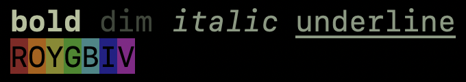

# gauze

Gauze is an embedded DSL for generating [`ReadableStream`s][readable-stream] of
text containing [ANSI escape sequences][ansi] using typed [JSX][jsx].

Child nodes can be async values or streams.

Here's an example:

```tsx
import { createElement } from '@superhighway/gauze'

;(
  <>
    <bold>bold</bold> <dim>dim</dim> <italic>italic</italic> <underline>underline</underline>
    {'\n'}
    <negative>
      <red>R</red>
      <color red="75%" green="25%" blue="0%">O</color>
      <yellow>Y</yellow>
      <green>G</green>
      <cyan>B</cyan>
      <blue>I</blue>
      <magenta>V</magenta>
    </negative>
    {'\n'}
  </>
).readable.pipe(process.stdout)
```

In my terminal that looks like this:

<!-- This screenshot is double-sized and shrank for HiDPI screens. -->


## Setup

To use Gauze, add these options to your `tsconfig.json`[^1]:
```json
"jsx": "react",
"jsxFactory": "createElement",
"jsxFragmentFactory": "createElement",
```

Also, `import { createElement } from '@superhighway/gauze'` in each of your
`.tsx` files.

[^1]: `"jsx": "react"` may seem odd because Gauze isn't related to React, but
TypeScript's JSX configuration is based around React's semantics.

[ansi]: https://en.wikipedia.org/wiki/ANSI_escape_code
[jsx]: https://facebook.github.io/jsx/
[readable-stream]: https://developer.mozilla.org/en-US/docs/Web/API/ReadableStream
